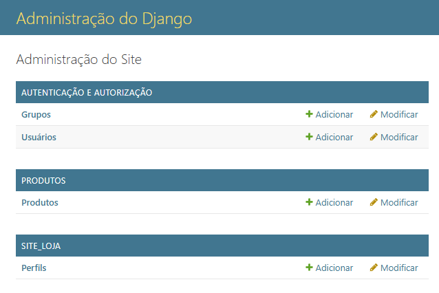
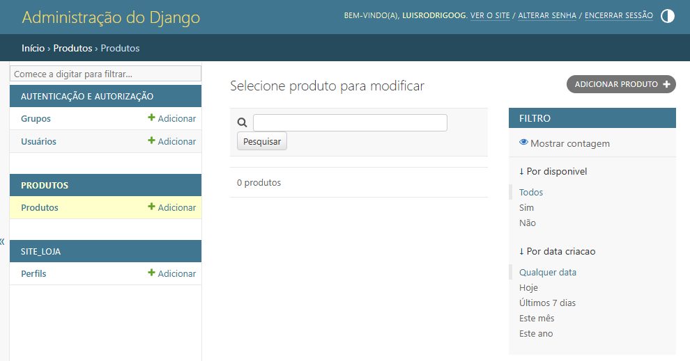

# 11.01.01 : Django Admin

> O objetivo deste material éapresentar a interface de administração do Django, que simlifica o gerenciamento de dados do seu projeto. 

## 🚀 O que é o Django Admin?

O **Django Admin** é uma das funcionalidades mais poderosas e convenientes do framework Django. Ele gera automaticamente uma interface de **administração** para seus **modelos**, permitindo que você **visualize, adicione, edite e exclua dados** do seu banco de dados sem precisar escrever código HTML ou formulários complexos. É uma ferramenta essencial para o gerenciamento de conteúdo e dados do seu aplicativo.

Pense nele como um **painel de controle pronto** para usar, que o Django configura para você automaticamente assim que você define seus modelos (as estruturas de dados do seu projeto).

## 📝 Configurando o Django Admin

Para que o **Django Admin** funcione, precisamos garantir que ele esteja configurado corretamente no seu projeto. 

### :one: Verificando as Aplicações Instaladas

O **Django Admin** é uma aplicação  como qualquer outra, ou seja ela precisa estar listada em **`INSTALLED_APPS`** no seu arquivo **`settings.py`**.

Abra o arquivo **`core/settings.py`** e verifique a seção **`INSTALLED_APPS`**. Você deve ver algo parecido com isto:

```python
# core/settings.py

INSTALLED_APPS = [
    'django.contrib.admin', # <-- Essa linha é crucial!
    'django.contrib.auth',
    'django.contrib.contenttypes',
    'django.contrib.sessions',
    'django.contrib.messages',
    'django.contrib.staticfiles',
    'produtos',   # Aplicação de produtos
    'site_loja',  # Aplicação do site da loja
]
```

Se **`django.contrib.admin`** estiver presente, está tudo certo\! Caso contrário, adicione-o.

### :two:  Sincronizando o Banco de Dados

Sempre que você faz alterações nos seus modelos ou instala novas aplicações, é importante rodar as migrações para que o Django crie ou atualize as tabelas no seu banco de dados. O Django Admin também precisa de suas próprias tabelas para funcionar.

Abra o seu terminal na raiz do projeto (`core`) e execute o seguinte comando:

```bash
python manage.py makemigrations
python manage.py migrate
```

  - `python manage.py makemigrations`: 
      - Este comando cria os arquivos de migração para suas aplicações (e também para as aplicações internas do Django, como o Admin), traduzindo as mudanças nos seus modelos para instruções que o banco de dados entende.
  
  - `python manage.py migrate`: 
      - Este comando aplica as migrações ao seu banco de dados, criando as tabelas necessárias e fazendo as alterações.

### :three: Criando um Superusuário

Para acessar o painel de administração, você precisa de um usuário com permissões de administrador, conhecido como **superusuário**.

No terminal, execute o seguinte comando:

```bash
python manage.py createsuperuser
```

O Django pedirá algumas informações:

  - **Username (deixe em branco para 'seu\_nome\_de\_usuario'):** 
      - Escolha um nome de usuário. 
      - Por exemplo, `admin`.
     
  - **Email address:** 
      - Um endereço de e-mail (opcional, mas recomendado). 
      - Por exemplo, `admin@exemplo.com`.
      
  - **Password:** 
      - Digite uma senha. 
      - Note que a senha não aparecerá enquanto você digita, por segurança.
      - 
  - **Password (again):** 
      - Digite a senha novamente para confirmar.

Se tudo correr bem, você verá uma mensagem confirmando que o superusuário foi criado com sucesso.

## 🎯 Acessando o Django Admin

Agora que configuramos tudo, é hora de ver o Django Admin em ação\!

### :one:  Iniciando o Servidor de Desenvolvimento

No seu terminal, certifique-se de que o servidor de desenvolvimento do Django esteja rodando:

```bash
python manage.py runserver
```

Você verá uma mensagem como: `Starting development server at http://127.0.0.1:8000/`.

### :two: Navegando para a Interface de Administração

Abra seu navegador e digite o seguinte endereço:

```
http://127.0.0.1:8000/admin/
```

Você será direcionado para uma tela de login. Use o nome de usuário e a senha que você criou com o comando **`createsuperuser`**.

Após fazer login, você verá o painel de administração do Django. Por padrão, ele exibirá os modelos de usuário e grupo (que fazem parte do sistema de autenticação do Django).

## 📄 Registrando Seus Modelos no Admin

Para que seus modelos de **`produtos`** e **`site_loja`** apareçam no painel de administração, você precisa registrá-los. Isso é feito no arquivo **`admin.py`** de cada aplicação.

Vamos supor que sua aplicação **`produtos`** tenha um modelo chamado **`Produto`** e a aplicação **`site_loja`** tenha um modelo **`Categoria`** e **`Pagina`**.

### :one: Registrando o Modelo **`Produto**` na Aplicação **`produtos`**

Abra o arquivo **`produtos/admin.py`** (se não existir, crie-o) e adicione o seguinte código:

```python
# produtos/admin.py

from django.contrib import admin
from .models import Produto # <-- Importa o modelo Produto da sua aplicação

# Registra o modelo Produto
admin.site.register(Produto)
```

### :two: Registrando os Modelos `Categoria` e `Pagina` na Aplicação `site_loja`

Agora, abra o arquivo `site_loja/admin.py` (crie-o se não existir) e adicione:

```python
# site_loja/admin.py

from django.contrib import admin
from .models import Perfil

admin.site.register(Perfil)
```

🌟 **Importante:** 
- Se você registrou novos modelos, pode ser necessário reiniciar o servidor de desenvolvimento (`Ctrl+C` no terminal e depois `python manage.py runserver` novamente) para que as alterações apareçam no Admin.

Após reiniciar o servidor e recarregar a página do Django Admin, você verá suas aplicações `Produtos` e `Site Loja` listadas, e dentro delas, os modelos que você registrou.

## 📘 Explorando a Interface do Django Admin

Agora que seus modelos estão visíveis, vamos ver o que você pode fazer.

### 🧩 Visão Geral da Página Principal

Na página principal do Admin, você verá uma lista de suas aplicações e, abaixo de cada uma, os modelos que você registrou.



  - Clique em um modelo (por exemplo, **Produtos**).

### 🧩 Página de Lista de Objetos

Ao clicar em um modelo, você será levado para a página de lista de objetos desse modelo. Aqui você pode:

  - **Adicionar um novo objeto:** 
      - Clique no botão "ADICIONAR [Seu Modelo]" (por exemplo, "ADICIONAR PRODUTO") no canto superior direito.
      
  - **Editar um objeto existente:** 
      - Clique no nome de qualquer objeto na lista.
      
  - **Excluir objetos:** 
      - Marque as caixas de seleção ao lado dos objetos que deseja excluir, selecione a ação "Excluir os itens selecionados" no menu suspenso "Ação" e clique em "Ir".
      
  - **Pesquisar:** 
      - Use a barra de pesquisa para encontrar objetos específicos.
      
  - **Filtrar:** 
      - Se você configurou filtros em seu `ModelAdmin` (veremos isso a seguir), eles aparecerão na barra lateral direita.
      
  - **Ordenar:** 
      - Clique nos cabeçalhos das colunas para ordenar a lista.

### 🧩 Página de Edição de Objeto

Ao adicionar um novo objeto ou editar um existente, você verá um formulário. O Django gera automaticamente este formulário com base nos campos definidos no seu modelo.

  - Preencha os campos.
  - **Salve:**
      - **Salvar e adicionar outro:** Salva o objeto atual e abre um novo formulário de criação.
      - **Salvar e continuar editando:** Salva as alterações e mantém você na mesma página de edição.
      - **Salvar:** Salva as alterações e retorna para a página de lista de objetos.
  - **Excluir:** Há um botão "Excluir" no canto inferior esquerdo para remover o objeto.


## Atualizando o modelo **`Produto`**

Realize os ajustes necessários para que arquivo **`produtos\models.py`** contenha as seguintes linhas:

```python
# produtos/models.py 
from django.db import models


##
# Aula 11 - 11.01.01
##
class Produto(models.Model):
    nome = models.CharField(max_length=100)
    descricao = models.TextField()
    preco = models.DecimalField(max_digits=10, decimal_places=2)
    estoque = models.PositiveIntegerField(default=0) # Campo para a quantidade em estoque
    disponivel = models.BooleanField(default=True) # Campo para indicar se o produto está disponível para venda
    imagem = models.ImageField(upload_to='produtos/', blank=True, null=True) # Campo para imagem

    # Campos de data para registro de criação e última atualização
    data_criacao = models.DateTimeField(auto_now_add=True)
    data_atualizacao = models.DateTimeField(auto_now=True)

    class Meta:
        # Define a ordem padrão dos produtos por nome
        ordering = ['nome']

    def __str__(self):
        return self.nome
```

Realize o processo de migração do modelo para o banco de dados.

```bash
python .\manage.py makemigrations
```

o Django fará uma pergunta sobre os campos `data_criacao` e `data_atualizacao` (e `estoque`, `disponivel` se eles também forem novos para você e sua tabela já tiver dados).

Você verá algo parecido com isto:

```
You are trying to add a non-nullable field 'data_criacao' to produto without a default;
values must be provided.
Please select a fix:
 1) Provide a one-off default now (will be set on all existing rows)
 2) Quit, and let me add a default in models.py
Select an option:
```

🎯 **Escolha a opção `1`** e pressione Enter.

O Django então perguntará qual valor padrão você quer usar. Para `data_criacao` e `data_atualizacao`, a melhor opção é usar o horário atual.

```
Please enter the default value now:
>>> timezone.now
```

**Importante:** Digite **`django.utils.timezone.now`** (sem aspas) e pressione Enter.

  * Se você não estiver usando fusos horários no seu projeto Django, ou se não importou `timezone` para o seu `models.py` (o que não é necessário para esta resposta), você também poderia usar `datetime.datetime.now` (você precisaria importar `datetime` no console do `makemigrations` se ele perguntar). No entanto, **`timezone.now` é a forma recomendada pelo Django**.

O Django então criará o arquivo de migração para o seu modelo `Produto`.

🎯  **Aplique as migrações:**

```bash
python manage.py migrate
```

Este comando irá aplicar as mudanças ao seu banco de dados, criando as novas colunas e preenchendo as linhas existentes com o valor padrão que você especificou (`django.utils.timezone.now`).


## 👨‍💻 Personalizando o Django Admin com `ModelAdmin`

O **Django Admin** é muito flexível e você pode personalizá-lo para atender às suas necessidades. Isso é feito criando uma classe **`ModelAdmin`** para cada modelo que você quer personalizar.

Vamos melhorar a exibição do modelo **`Produto`** na sua aplicação **`produtos`**.

Abra **`produtos/admin.py`** novamente e modifique-o para algo assim:

```python
# produtos/admin.py

from django.contrib import admin
from .models import Produto

# Define uma classe ModelAdmin para o modelo Produto
class ProdutoAdmin(admin.ModelAdmin):
    # Campos que serão exibidos na página de lista de objetos
    list_display = ('nome', 'preco', 'estoque', 'disponivel')
    
    # Campos que podem ser clicados para ordenar a lista
    list_display_links = ('nome',)
    
    # Adiciona uma barra lateral de filtro para os campos
    list_filter = ('disponivel', 'data_criacao') # Supondo que você tenha um campo data_criacao
    
    # Adiciona uma barra de pesquisa
    search_fields = ('nome', 'descricao') # Pesquisa por nome ou descrição
    
    # Permite editar campos diretamente na lista (cuidado com isso em produção!)
    list_editable = ('preco', 'estoque', 'disponivel')
    
    # Pre-popula o campo 'slug' (se você tiver um) baseado no 'nome'
    # prepopulated_fields = {'slug': ('nome',)}
    
    # Agrupa campos no formulário de edição/criação
    fieldsets = (
        (None, {
            'fields': ('nome', 'descricao', 'preco', 'estoque', 'disponivel', 'imagem')
        }),
    )

# Registra o modelo Produto com a sua classe ModelAdmin personalizada
admin.site.register(Produto, ProdutoAdmin)
```

🧪 **Explicação dos atributos `ModelAdmin`:**

  - **`list_display`**: 
      - Uma tupla ou lista de nomes de campos que serão exibidos como colunas na página de lista de objetos do Admin.
      
  - **`list_display_links`**: 
      - Uma tupla ou lista de nomes de campos em `list_display` que se tornarão links para a página de edição do objeto.
      
  - **`list_filter`**: 
      - Uma tupla ou lista de nomes de campos que serão usados para criar filtros na barra lateral direita da página de lista de objetos. 
      - Útil para filtrar por status, datas, etc.
      
  - **`search_fields`**: 
      - Uma tupla ou lista de nomes de campos que o Admin usará para a funcionalidade de pesquisa. 
      - A pesquisa é baseada em `LIKE` no banco de dados.
      
  - **`list_editable`**: 
      - Uma tupla ou lista de nomes de campos que podem ser editados diretamente na página de lista de objetos, sem precisar entrar na página de edição individual. Use com cautela\!
      
  - **`prepopulated_fields`**: 
      - Um dicionário que mapeia campos `SlugField` para os campos dos quais eles devem ser preenchidos automaticamente no formulário de edição/criação.
      
  - **`fieldsets`**: 
      - Uma lista de tuplas que define a ordem, o agrupamento e a aparência dos campos no formulário de edição/criação. Cada tupla representa um "fieldset" (um grupo de campos).
      - A primeira parte da tupla é o título do fieldset.
      - A segunda parte é um dicionário com chaves como `fields` (uma tupla ou lista de campos) e `classes` (uma tupla de classes CSS, como `'collapse'` para fazer o fieldset recolhível).



